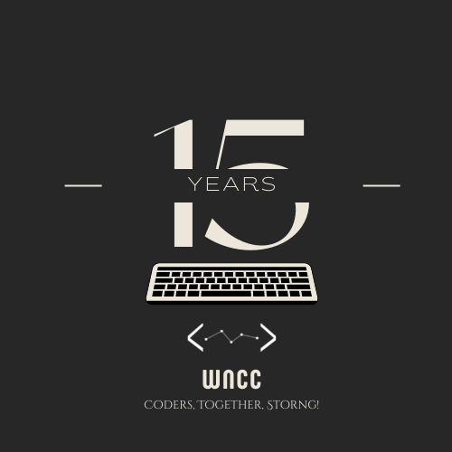

# CodeWars-v2

This contains the Game Engine for CodeWars-v2. The second iteration of India's first bot-programming contest, This time reshaped as an algorithmic trading contest.

You may find out all about the competition [here](https://bit.ly/3K2cG4n).

You just need to download the files corresponding to your system, and follow the guidelines provided in the documentation to start testing.

The Actual Trading would start at 10:45 PM.

The Result have been declared!

The Winners are :

1. Lame Street : Parshant Arora, Prathamesh Pilkhane, Vedang Asgaonkar
2. Stonks : Kaushal Jadhav, Shrey Ganatra, Jahnvi Rohela
3. Codewarriors : Tanmay Dokania, Navneet, Aziz Shameem

All the Teams that had either submitted the same file which we gave them as a sample(exact or with minute changes), as well as those whose code didn't compile(/did stuff it wasn't supposed to) have been disqualied. The Results for all the other teams is available [here](Result.pdf).

We ran the code for various market settings as labelled in the columns.
